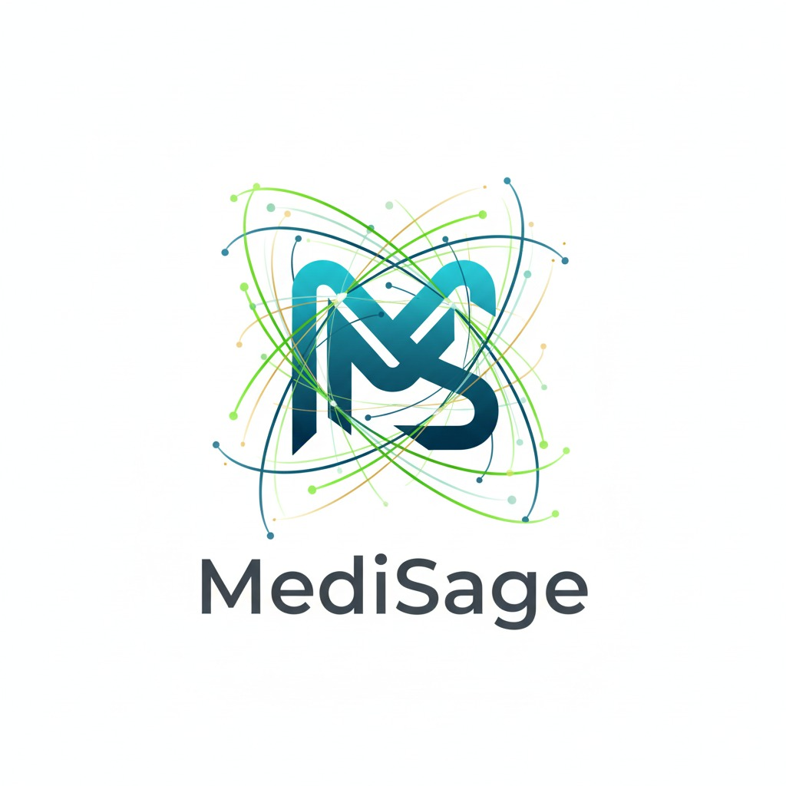
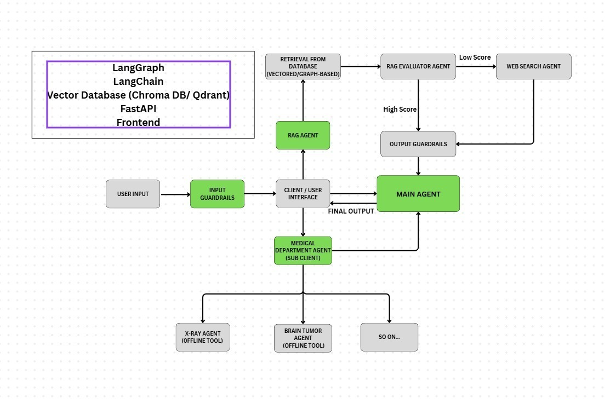

# 🩺 MediSage  
_A Multilinugal Multimodal Multi-Agent Medical Assistant - Where healthcare meets responsible AI._


<p align="center">
  
</p>

---

## 🧠 Overview


We are building a Multilinugal Multimodal Multi-Agent Medical Assistant - an AI-powered healthcare assistant capable of understanding **speech, text, and image inputs** to help with **symptom triage, preliminary diagnosis support, medical research, and patient follow-up.**
The system coordinates multiple specialized sub-agents under one unified conversational interface. It maintains **stateful memory** across sessions, supports **multilingual communication,** and includes a **graph-based UI for care visualization**. A **human-in-the-loop** validation mechanism ensures clinical safety, while **self-improving RL based post-training** continuously enhances accuracy through verified feedback.

**Specific pain points addressed:**

- **Limited healthcare access**: Many patients in both rural and urban areas, lack timely medical consultation due to doctor shortages and travel barriers.

- **Language and literacy barriers**: Existing digital health solutions often fail to support regional languages or voice-based interactions.

- **Clinician workload** : Repetitive triage, patient follow-ups, and basic symptom assessments consume valuable clinician time.

- **Fragmented patient journey**: Missed follow-ups and poor continuity of care lead to delayed or incomplete treatments.

- **Trust in AI tools**: Lack of explainability and human oversight makes patients hesitant to rely on automated systems.

Our solution directly tackles these challenges by combining accessibility, safety, and contextual intelligence.

---

## 🏗️ Architecture

<!-- Add your architecture image below -->
<p align="center">
  
</p>

The architecture integrates:
- **Multimodal Inputs:** Speech, text, and image understanding  
- **LLM-Powered Reasoning:** Contextual dialogue and decision support  
- **RAG Agent:** Retrieval-Augmented Generation pipeline for knowledge-backed responses  
- **Medical Decision Agents:** Specialized models for skin, brain, and chest X-ray analysis  
- **Human-in-the-Loop Validation:** Ensuring clinical safety and reliability  
- **Output Guardrails:** For ethical and accurate information delivery  

---

## 📁 Repository Structure

```

MediSage/
│
├── data/                        # Knowledge and embedding storage
│   ├── chroma_db/               # Chroma vector database
│   ├── docs_db/                 # Raw document database
│   ├── parsed_docs/             # Preprocessed / cleaned documents
│   ├── qdrant_db/               # Qdrant vector store
│   ├── raw/                     # Unprocessed medical datasets
│   └── raw_extras/              # Supplementary or test data
│
├── rag_agent/                   # Core RAG Agent components
│   ├── **init**.py
│   ├── content_processor.py     # Cleans and structures content for ingestion
│   ├── doc_parser.py            # Parses PDFs / docs into text chunks
│   ├── query_expander.py        # Enhances user queries for better retrieval
│   ├── reranker.py              # Re-ranks retrieved results for relevance
│   ├── response_generator.py    # Generates context-aware answers
│   ├── vectorstore_chroma.py    # Interface for Chroma vector DB
│   ├── config.py                # Configuration and environment settings
│   ├── ingest_rag_data.py       # Data ingestion and embedding generation
│   └── test_rag_agent.py        # Unit tests for the RAG pipeline
│
├── .gitignore                   # Ignore unnecessary files
└── README.md                    # Project documentation

````

---

## ⚙️ Current Progress

✅ **Completed:**
- RAG Agent setup with modular pipeline (parser, query expansion, reranker, response generator)  
- Configurable vectorstore integrations (ChromaDB)  
- Structured data directories for document ingestion and embeddings  
- Initial testing framework for the RAG pipeline  

🧩 **In Progress:**
- Assistant chatbot integration  
- Medical agent decision module (skin, brain, chest)  
- Speech-to-text and text-to-speech pipelines  
- Multilingual interface and UI state management graph  

🧱 **Planned Next:**
- Reinforcement learning loop for continual improvement  
- Human-in-the-loop review dashboard  
- Integration with external APIs (calendar, reminder, etc.)  

---

## 🚀 Getting Started

### Prerequisites
- Python 3.10+  
- Install dependencies:
```bash
pip install -r requirements.txt
````

### Run the RAG Agent

```bash
python rag_agent/test_rag_agent.py
```

### Ingest New Documents

```bash
python rag_agent/ingest_rag_data.py
```

---

## 🌍 Vision

MediSage aims to make **accessible, intelligent, and safe medical assistance** available to every individual — bridging the gap between patients and healthcare professionals through trustworthy AI collaboration.

---

## 🤝 Contributors

- [Khush Agrawal](https://github.com/Khushmagrawal) 
- [Sujal Sakpal](https://github.com/sujal-sakpal)  

---


> **Note:** This repository is under active development. Modules, data structures, and APIs may evolve as the project progresses.

